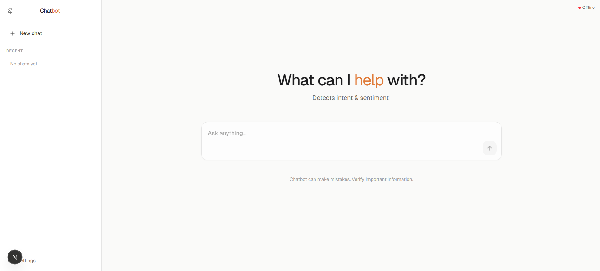
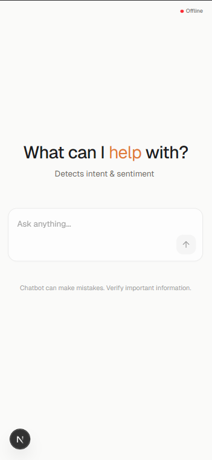

<div align="center">

```
    █████╗ ██╗    ██████╗██╗  ██╗ █████╗ ████████╗██████╗  ██████╗ ████████╗
   ██╔══██╗██║   ██╔════╝██║  ██║██╔══██╗╚══██╔══╝██╔══██╗██╔═══██╗╚══██╔══╝
   ███████║██║   ██║     ███████║███████║   ██║   ██████╔╝██║   ██║   ██║   
   ██╔══██║██║   ██║     ██╔══██║██╔══██║   ██║   ██╔══██╗██║   ██║   ██║   
   ██║  ██║██║   ╚██████╗██║  ██║██║  ██║   ██║   ██████╔╝╚██████╔╝   ██║   
   ╚═╝  ╚═╝╚═╝    ╚═════╝╚═╝  ╚═╝╚═╝  ╚═╝   ╚═╝   ╚═════╝  ╚═════╝    ╚═╝   
                                                                              
```

<div align="center">

### [🚀 Try the Live Demo](https://ai-chat-intelligence-zl1k.vercel.app/)

> [!NOTE]
> This demo uses the Gemini Free Tier API. If the API hits its rate limit, the chatbot will automatically and silently fall back to logic-based mock responses to ensure the conversation never breaks.

</div>

### AI Chat with Conversation Intelligence


</div>

<br />

<p align="center">
  
</p>

<p align="center">
  
</p>

<br />

<br />

---

## ✨ Features

| 💬 **Chat** | 🧠 **Intelligence** | 📂 **Persistence** | ⚡ **Streaming** |
|:--|:--|:--|:--|
| Clean right-aligned user bubbles, left-aligned AI responses | Intent + sentiment extracted per message via Gemini or keyword NLP | **Supabase Connected:** Sessions and messages are persisted in PostgreSQL | 60fps word-by-word SSE streaming with progressive markdown |
| Markdown rendering with syntax-highlighted code blocks | 8 intent categories, 3 sentiment polarities | Sidebar with hover-to-expand, pin-to-lock | Typing indicator with animated amber cursor |

| 🔑 **BYO Key** | 🛡️ **Fallback** | 🎨 **Design** | 📱 **Responsive** |
|:--|:--|:--|:--|
| Settings modal — paste your Gemini key, stored in localStorage | **Graceful Fallback:** If Gemini hits rate limits (free tier), it silently reverts to mock logic | Warm amber accent, Geist fonts, glassmorphism input | Works on desktop and mobile, sidebar adapts |

---

## 🚀 Quick Start (Local Development)

This project is a Vercel-optimized monorepo. Both the Next.js frontend and FastAPI backend live inside the `AI-Chat/` directory.

```bash
# 1. Start the Python Backend (terminal 1)
cd AI-Chat/api
python -m venv venv
venv\Scripts\activate      # Windows
# source venv/bin/activate # Mac/Linux
pip install -r requirements.txt uvicorn
python index.py                    # → http://localhost:8765

# 2. Start the Next.js Frontend (terminal 2)
cd AI-Chat
npm install
npm run dev                       # → http://localhost:3000
```

**Gemini:** paste your key in the Settings modal (gear icon in sidebar), or add `GEMINI_API_KEY=...` to `AI-Chat/api/.env`.

**Supabase:** run `backend/schema.sql` (or `AI-Chat/api/schema.sql` if moved) in your Supabase SQL editor, then add `SUPABASE_URL` + `SUPABASE_SERVICE_KEY` to `AI-Chat/api/.env`. Works fine without it — falls back to in-memory storage.

---

## 📁 Project Structure

```
📂 ai-chat-intelligence
│
├── 📂 AI-Chat/                          # Vercel Root Directory
│   ├── 📂 api/                          # FastAPI + Python Serverless Functions
│   │   ├── index.py                     # Entry point (Vercel Serverless Function)
│   │   ├── models.py                    # Pydantic schemas
│   │   ├── db.py                        # Supabase + memory fallback
│   │   ├── responses.py                 # Gemini + logic-based generation
│   │   ├── requirements.txt             # Backend dependencies
│   │   ├── routers/                     # API Endpoints
│   │   │   ├── chat.py                  # /chat, /chat/stream (SSE)
│   │   │   ├── sessions.py              # /sessions CRUD
│   │   │   └── config.py                # /config LLM settings
│   │   └── services/                    # Business Logic
│   │       ├── nlp.py                   # Intent & sentiment
│   │       └── streaming.py             # SSE generators
│   │
│   ├── src/                             # Next.js 16 + TypeScript + Tailwind
│   │   ├── app/                         # App Router
│   │   ├── components/                  # React Components
│   │   ├── context/                     # Global State
│   │   └── lib/                         # Utilities & API client
│   │
│   ├── vercel.json                      # Vercel edge routing override
│   ├── next.config.ts                   # Next.js config
│   └── package.json                     # Frontend dependencies
│
├── ss1.png                              # Desktop screenshot
└── ss2.png                              # Mobile screenshot
```

---

## 🔄 Architecture

```
 ┌──────────┐      POST /chat/stream      ┌──────────────┐
 │  Browser │ ──────────────────────────→ │   FastAPI    │
 │  :3000   │ ←── text/event-stream ──── │   :8765      │
 └──────────┘                             └──────┬───────┘
                                                 │
                          ┌──────────────────────┼──────────────────────┐
                          │                      │                      │
                    ┌─────▼─────┐        ┌───────▼───────┐      ┌──────▼──────┐
                    │  Gemini   │        │  Intent +     │      │  Supabase   │
                    │  2.5 Flash│        │  Sentiment    │      │  PostgreSQL │
                    │  (primary)│        │  Extraction   │      │  (optional) │
                    └───────────┘        └───────────────┘      └─────────────┘
```

| # | Step |
|:-:|------|
| 1 | User types → `InputBox` fires `sendMessage` |
| 2 | `ChatContext` opens SSE stream to `/chat/stream` |
| 3 | Backend extracts **intent** + **sentiment** (Gemini → keyword fallback) |
| 4 | Response streams **char-by-char** at 60fps |
| 5 | `MessageList` renders **markdown** progressively |
| 6 | Stream ends → **insight badges** fade in (intent + sentiment) |
| 7 | User + AI messages persisted to Supabase (or memory) |

---

## 🧠 Conversation Insights

```
Intent: request · Sentiment: positive
```

| Intent | Sentiment |
|--------|-----------|
| `greeting` `farewell` `complaint` `request` | 🟢 `positive` |
| `thanks` `feedback` `query` `unknown` | ⚪ `neutral` |
| | 🔴 `negative` |

Extracted by Gemini when configured, otherwise smart keyword-based NLP.

---

## 🎨 Design

| Token | Value |
|-------|-------|
| Accent | `#E07B39` |
| Background | `#FAFAF9` |
| Typography | Geist Sans + Geist Mono |
| Animations | Framer Motion — spring physics, staggered |
| Input | Glassmorphism pill, backdrop blur |
| Sidebar | Hover-to-expand, 300ms cubic-bezier |

---

## 🛠 Stack

**Frontend:** Next.js 16.2 · React 19 · TypeScript · Tailwind CSS 4 · Framer Motion · react-markdown · Lucide

**Backend:** Python 3.13 · FastAPI · Uvicorn · Google Gemini · Supabase

---

<p align="center">
  <sub>MIT License · Built to win</sub>
</p>
